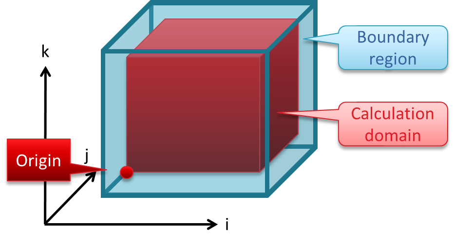

.. include:: ../defs.hrst

.. _getting_started:

===============
Getting Started
===============

This chapter describes how to use |GT| to solve a (simple) PDE.
We will use the fourth-order horizontal smoothing filter example from
with small modifications to explain the necessary steps to assemble a
stencil from scratch. We will not go into details in this chapter but
refer to latter chapters for more details.

Our example PDE is given by

.. math::
   \frac{\partial \phi}{\partial t} =\begin{cases}
   - \alpha \nabla^4 \phi & z \leq z_\text{max}\\
   0 & z > z_0
   \end{cases}

where :math:`\nabla^4` is the squared two dimensional horizontal
Laplacian and we apply the filter only up to some maximal :math:`z_0` (to make
the example more interesting). The filter is calculated in two steps:
first we calculate the Laplacian of :math:`\phi`

.. math::
   L = \Delta \phi = \left( \frac{\partial^2}{\partial x^2} + \frac{\partial^2}{\partial y^2}\right) \phi

then we calculate the Laplacian of :math:`L` as :math:`-\alpha \nabla^4 \phi = -\alpha  \Delta L`.

In the following we will walk through the following steps:

-   The |GT| coordinate system and its notation.
-   Storages: how does |GT| manage the input and output fields.
-   The first stencil: calculating :math:`L`, the second order Laplacian of :math:`\phi`.
-   The final stencil: function calls, Do-method overloads and temporaries
-   MISSING: How to pass the :math:`\alpha`: Global accessors
-   MISSING: Distributing the work over multiple nodes: GCL
-   MISSING: Boundaries

-----------------
Coordinate System
-----------------

For a finite difference discretization we restrict the field
:math:`\phi \in \mathbb{R}^3` to a discrete grid. We use the notation
:math:`i = x_i` and :math:`j = y_j` for the horizontal dimension and :math:`k = z_k` for
the vertical dimension, where :math:`x_i, y_j, z_k` are the :math:`x,y,z`
coordinates restricted on the grid. The *computation domain* is defined
by all grid points in our domain of interest

.. math:: 

   \Lambda = (i,j,k) \quad \text{with}\quad i \in \{ 0\dots N_i-1\}, j \in \{0\dots N_j-1\}, k\in\{0 \dots N_k-1\}

|GT| supports any number of dimension, however it will treat
one dimension, here the :math:`k`, dimension differently: the :math:`ij`-plane is
executed in parallel while the computation in :math:`k` can be sequential. The
consequence is that there must not be a dependency in :math:`ij` within a
stencil while there can be a dependency in :math:`k`. For now (this chapter)
it is sufficient to just remember that the :math:`ij`-plane and the :math:`k`
dimension are treated differently by |GT|.

The calculation domain is surrounded by a *boundary region* as depicted
in :numref:`fig_getting_started_coordinates`. Computation happens
only within the calculation domain but values may be read from grid
points in the boundary region.

.. _fig_getting_started_coordinates:

   
   Coordinate system
   
--------
Storages
--------

In this section we will setup the fields for our example: we need a
storage for the :math:`\phi`-field (``phi_in``) and a storage for the output
(``phi_out``).

Storages in |GT| are n-dimensional array-like objects with the
following capabilities:

-   access an element with :math:`(i,j,k)` syntax

-   syncronization between CPU memory and a device (e.g. a CUDA capable GPU)

^^^^^^^
Backend
^^^^^^^

Since the storages (and other things later) depend on the architecture
(e.g. CPU or GPU) our first step is to define the *target* type which
typically looks like 

.. literalinclude:: code/playing_with_the_storage.cpp
   :language: gridtools
   :lines: 8

for the CUDA backed or
 
.. literalinclude:: code/playing_with_the_storage.cpp
   :language: gridtools
   :lines: 10

for the CPU backend and the backend
 
.. literalinclude:: code/playing_with_the_storage.cpp
   :language: gridtools
   :lines: 12

which will be used later.

The second argument to ``backend`` defines the type of the grid, where ``structured`` refers to a
Cartesian-like grid. The last argument defines that blocking should be used.
See :ref:`backend-selection` for details.

^^^^^^^^^^^^^^^^
The storage type
^^^^^^^^^^^^^^^^

For efficient memory access the index ordering might depend on the target architecure, therefore the
memory layout will implicitly decided by target via the storage traits as follows.

For each storage type we need to define the type of the data we want to
store in the field, e.g. ``double``, and a ``storage_info`` type which will hold
information about size, alignment, strides etc. When creating the ``storage_info`` via the storage
traits we need to provide a unique index and the number of dimensions for the storage (typically 3).

.. literalinclude:: code/playing_with_the_storage.cpp
   :language: gridtools
   :lines: 14-15

At run-time a ``storage_info`` is
initialized with the sizes of the field. Then a field can be
instantiated with the ``info`` object. 

.. literalinclude:: code/playing_with_the_storage.cpp
   :language: gridtools
   :lines: 18-25
   :dedent: 4

The first argument, the ``info``
object, is mandatory, while the other arguments are optional: a name for
the field and an initial value.

.. note::

   For each ``storage_info`` type it is recommended to use only one instantiation. The mapping between a storage and the  
   run-time information in the ``storage_info`` has to be done at compile time via the index. Thus |GT| cannot 
   distinguish the storages by the run-time sizes passed to the ``storage_info``. Using ``data_store`` s with same
   ``storage_info`` type but different run-time sizes in the same computation is undefined behaviour.

We can now

-   retrieve the name of the field,
-   create a view and read and write values in the field using the parenthesis syntax,
-   syncronize data between device and host (in CUDA mode).

.. literalinclude:: code/playing_with_the_storage.cpp
   :language: gridtools
   :lines: 27-33
   :dedent: 4

--------
Stencils
--------

A *stencil* is a kernel that updates array elements according to a fixed
access pattern.

^^^^^^^^^^^^^^^^^^^^^^^^^^^
Example: Naive 2D Laplacian
^^^^^^^^^^^^^^^^^^^^^^^^^^^

The simplest discretization of the 2D Laplacian is the finite difference
five-point stencil as depicted in :numref:`fig_getting_started_2dlap`.

.. _fig_getting_started_2dlap:
.. figure:: figures/Laplacian2D.png
   :scale: 60 %
   
   Access pattern of a 2D Laplacian

For the calculation of
the Laplacian at a given grid point we need the value at the grid point
itself and its four direct neighbors along the Cartesian axis.

A naive C++ implementation of the 2D Laplacian stencil is provided in

.. literalinclude:: code/naive_laplacian.cpp
   :language: gridtools

Apart from the initialization the stencil implementation
consists of 2 main components:

- Loop-logic: defines the stencil application domain and loop order
- Update-logic: defines the update formula (here: the 2D Laplacian)

Special care had to be taken at the boundary of the domain. Since the
Laplacian needs the neighboring points we cannot calculate the Laplacian
on the boundary layer and have to exclude them from the loop.

------------------
First |GT| stencil
------------------

In |GT| the loop logic and the storage order is implemented
(and optimized) by the library while the update function is implemented
by the user. The loop logic (for a given architecture) is combined with
the user-defined update function at compile-time by template
meta-programming.

^^^^^^^^^^^^^^^^^^^^^^^^^^^^^^^
Update-logic: |GT| 2D Laplacian
^^^^^^^^^^^^^^^^^^^^^^^^^^^^^^^

The update-logic is implemented with state-less functors. A
|GT| functor is a ``struct`` or ``class`` providing a *static* method
called ``Do``. The update-logic is implemented in these ``Do``-methods.
As the functors are state-less (no member variables, static methods
only) they can be passed by type, i.e. at compile-time, and therefore
allow for compile-time optimizations.

.. literalinclude:: code/gt_laplacian.cpp
   :language: gridtools
   :start-after: using namespace gridtools;
   :end-before: int main() {

In addition to the ``Do``-method, the functor contains ``accessor`` s. These
two ``accessor`` s are parameters of the functor, i.e. they are mapped to
fields passed to the functor. They contain compile-time information if
they are only used as input parameters, e.g. the ``in`` accessor in the
example, or if we want to write into the associated field (``inout``). Additionally,
the ``extent`` defines which grid-points are needed by the stencil relative
to the current point. The format for the extent is

.. code-block:: gridtools

   extent<i_minus, i_plus, j_minus, j_plus, k_minus, k_plus>

where ``i_minus`` and ``i_plus`` define an interval on the :math:`i`-axis relative to
the current position; ``i_minus`` is the negative offset, i.e. zero or a
negative number, while ``i_plus`` is the positive offset. Analogously for
:math:`j` and :math:`k`. In the Laplacian example, the first two number
in the extent of the ``in`` accessor define that we want to access the
field at :math:`i-1,i,i+1`. The accessor type and the extent is needed for a
dependency analysis in the compile-time optimizations for more complex
stencils. (For example, the computation 
domain needs to be extended when we calculate the Laplacian of the Laplacian later. This is done automatically by the 
library.)

The first template argument is an index defining the order of the
parameters, i.e. the order in which the fields are passed to the
functor. The ``arg_list`` is a |GT| keyword which has to be defined for each stencil.

A ``Do``-method needs as first parameter a context
object, usually called ``eval``, which is created and passed to the method by the library on
invocation. This object contains, among other things, the index of the
active grid point and the mapping of data-pointers to the ``accessor`` s. The
second argument is optional and specifies the interval on the :math:`k`-axis where this implementation
of the ``Do``-method should be executed. This allows to apply a different update-logic on
intervals by overloading the ``Do``-method. We will define intervals
later. If the second parameter is not specified, a default interval is assumed.

The body of the ``Do``-method looks quite similar to the one in the
naive implementation, except that each
field access has to be wrapped by a call to the context object ``eval``.
This is necessary to map the compile-time parameter, the ``accessor``, to
the run-time data in the ``data_store``.

^^^^^^^^^^^^^^^^^^^
Calling the stencil
^^^^^^^^^^^^^^^^^^^

In the naive implementation, the call to the
``laplacian`` is as simple as

.. code-block:: gridtools

   int boundary_size = 1;
   laplacian( lap, phi, boundary_size );

since it contains already all the information: the update-logic *and*
the loop-logic.

The |GT| stencil, does not contain any
information about the loop-logic, i.e. about the domain where we want to apply the stencil operation,
since we need to specify it in a platform-independent syntax, a *domain specific embedded language*
(DSEL), such that the backend can decide on the specific implementation.

For our example looks as follows

.. literalinclude:: code/gt_laplacian.cpp
   :language: gridtools
   :start-after: int main() {
   :end-before: }
   :dedent: 4 
   :linenos:

.. todo::

   update line numbers and fix example

In line 1 and 2 we define placeholders for the fields.

In lines 4-9 we setup the physical dimension of the problem.
First we define which points on the :math:`i` and the :math:`j`-axis belong
to the computational domain and which points belong to the boundary (or
a padding region). For now it is enough to know that these lines define
an axis with a boundary of size 1 surrounding the :math:`ij`-plane. In the
next lines the layers in :math:`k` are defined. In this case we have only one
interval. We will discuss the details later.

In lines 15-21 we create the stencil object.
We pass the domain (the mapping between placeholders and storages), the
grid (the information about the loop bounds) and a so-called ``multistage``. The ``multi_stage``
contains a single ``stage``, our Laplacian functor.

In more complex codes we can combine multiple :math:`k`-independent ``stage`` s in
a ``multi_stage``. If we have a :math:`k`-dependency we have to split the computation
in multiple ``multi_stage`` s.

The statement ``execute<forward>`` defines that we want to iterate over :math:`k` in a
forward manner, i.e. starting from the smallest :math:`k`-value to the
largest. Other execution modes are ``backward`` and ``parallel``. For performance reason ``parallel`` should be used
whenever possible.

The next lines 23 and
24 are mandatory: we allocate temporary
storages (in our case we don't use any) and syncronize the fields to the
device (if we use the CUDA backend).

Line 26 is self-explanatory: the stencil is
executed.

In the last line we cleanup: we free temporary storages and copy modified fields
back to the host.

In a more realistic application the ``run()`` will be called multiple
times without syncronizing to the host. If we want to inspect the fields between runs (i.e. before the
``finalize()``) we have to sync ``data_store`` s manually.

^^^^^^^^^^^^^^^^^^^
Full |GT| Laplacian
^^^^^^^^^^^^^^^^^^^

The full working example looks as follows:

.. literalinclude:: code/gt_laplacian.cpp
   :language: gridtools
   :linenos:
   
There are some points which we did not discuss so far. For a first look at |GT| these can be considered fixed patterns and 
we won't discuss them now in detail. In brief:

- In order to use the :math:`(i,j,k)` syntax we need to define the symbols to point to the respective dimensions.
- A common pattern is to use the preprocessor flag ``__CUDACC__`` to distinguish between CPU and GPU code. We use this to set the backend.

-------------------------------------
Assembling stencils: smoothing filter
-------------------------------------

In the preceding section we saw how a first simple |GT| stencil
is defined and executed. In this section we will use this stencil to
compute our example PDE. A naive implementation could look as in

.. literalinclude:: code/naive_smoothing.cpp
   :language: gridtools

For the |GT| implementation we will learn three things in this
section: how to define special regions in the :math:`k`-direction; how to use
|GT| temporaries and how to call functors from functors.

^^^^^^^^^^^^^^^^^^
Do-method overload
^^^^^^^^^^^^^^^^^^

Our first |GT| implementation will be very close to the naive
implementation: we will call two times the Laplacian functor from the
previous section and store the result in two extra fields. Then we will
call a third functor to compute the final result. This functor shows how
we can specialize the computation in the :math:`k`-direction:

.. literalinclude:: code/gt_smoothing_version1.cpp
   :language: gridtools
   :start-after: using namespace gridtools;
   :end-before: using axis_t = axis<2>;

We define two
intervals, the ``lower_domain`` and the ``upper_domain``, and provide an overload of the
``Do``-method for each interval.

The intervals are defined as

.. literalinclude:: code/gt_smoothing_version1.cpp
   :language: gridtools
   :start-after: };
   :end-before: int main() {

Since we are working currently on a nicer API to define the intervals we
don't want to describe the (non-trivial) details now. In short: the
first entry in the ``level`` is a so-called ``splitter``, an abstraction to tell
that we want to split the axis here. The second entry is an ``offset``
relative to the splitter. At runtime we assign an index of the k-axis to
the splitters. Then the ``level<X,-1>`` corresponds to the index in the ``value_list[X]``
entry. Additionally we have to define an ``axis`` such that all intervals
are a strict subset of the ``axis``.

The intervals are defined as

.. literalinclude:: code/gt_smoothing_version1.cpp
   :language: gridtools
   :start-after: int main() {
   :end-before: }
   :dedent: 4

In this version we needed to explicitly allocate the temporary fields
``lap`` and ``laplap``. In the next section we will learn about
|GT| temporaries.

^^^^^^^^^^^^^^^^
|GT| temporaries
^^^^^^^^^^^^^^^^

*|GT| temporary storages* are storages with the lifetime of the
``computation``, i.e. they can be used by different stages assembled in one
``make_computation`` call. This is exactly what we need for the ``lap`` and ``laplap``
fields.

.. note::

   Note that temporaries are not allocated explicitly and we cannot
   access them from outside of the computation. Therefore, sometimes it might be
   necessary to replace a temporary by a normal storage for debugging.

To use temporary storages we don't need to change the functors or the
``make_computation``. We just have to replace the type the ``arg`` by a ``tmp_arg``. We don't need the explicit
instantiations any more and we can leave out pointers to storages when
we build the ``domain``. The new code looks as follows

.. todo::

   getting_started/gt_smoothing_version2_computation.hpp

The temporary
storages are allocated in the call to ``ready`` and freed in ``finalize()``. Besides 
the simplifications in the code (no explicit storage needed), the
concept of temporaries allows |GT| to apply optimization. While normal storages
have a fixed size, temporaries can have block-private halos which are used for redundant computation.

.. note::

   It might be semantically incorrect to replace a temporary with a normal storage, as normal storages don't have the halo
   region for redundant computation. In such case several threads (OpenMP or CUDA) will write the same location multiple
   times. As long as all threads write the same data (which is a requirement for correctness of |GT|), this should be
   no problem for correctness on current hardware (might change in the future) but might have side-effects on performance.

^^^^^^^^^^^^^
Functor calls
^^^^^^^^^^^^^

The next feature we want to use is the *stencil function call*. In the first example we computed the Laplacian 
and the Laplacian of the Laplacian explicitly and stored the intermediate values in the temporaries. Stencil function 
calls will allow us do the computation on the fly and will allow us to get rid of the temporaries. With this feature 
on each neighbor point of the primal stencil the stencil function is executed.

.. note:: 

   Note that this is 
   not necessarily a performance optimization. It might well be that the version with temporaries is actually the 
   faster one.

In a  first step we remove only one of the temporaries. Instead of calling the Laplacian twice from the 
``make_computation`` we will move one of the calls into the smoothing functor. The new smoothing functor looks as 
follows

.. todo::
   
   getting_started/gt_smoothing_version3.hpp

In ``call`` we specify the functor and the ``Do``-method overload we want to apply.
In ``with`` the 
``eval`` is passed forward followed by all the input arguments for the functor. The functor in the call is required to 
have exactly one ``inout_accessor`` which will be the return value of the call.

The attentive reader may have noticed that our first versions did more
work than needed: we calculated the Laplacian of the Laplacian of phi
(:math:`\Delta \Delta \phi`) for all :math:`k`-levels, however we used it only for
:math:`k<k_\text{max}`. In this version we do a bit better: we still calculate
the Laplacian (:math:`L = \Delta \phi`) for all levels but we only calculate
:math:`\Delta L` for the levels where we need it.

^^^^^^^^^^^^^^^^^
Full code listing
^^^^^^^^^^^^^^^^^

The full compilable version of the code is given is here:

.. todo::

   getting_started/generated_files/full_gridtools_smoothing.cpp

^^^^^^^^^^^^^^^^^^^^^^^^^^^^^^^^^^^^^^^^^^^^^^^^^^^^^^
TODO: How to pass the :math:`\alpha`: Global accessors
^^^^^^^^^^^^^^^^^^^^^^^^^^^^^^^^^^^^^^^^^^^^^^^^^^^^^^

^^^^^^^^^^^^^^^^^^^^^^^^^^^^^^^^
TODO: Distributing the work: GCL
^^^^^^^^^^^^^^^^^^^^^^^^^^^^^^^^

^^^^^^^^^^^^^^^^^^^^^^^^^
TODO: Boundary conditions
^^^^^^^^^^^^^^^^^^^^^^^^^

.. include:: installation.hrst

