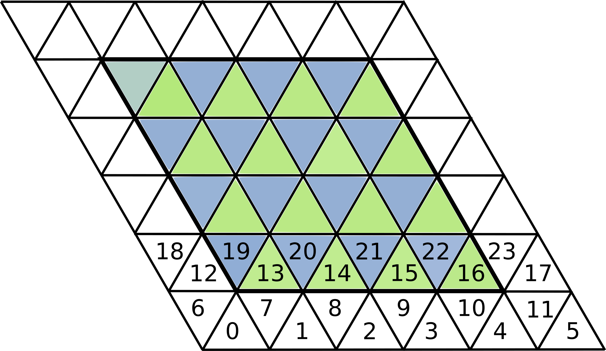
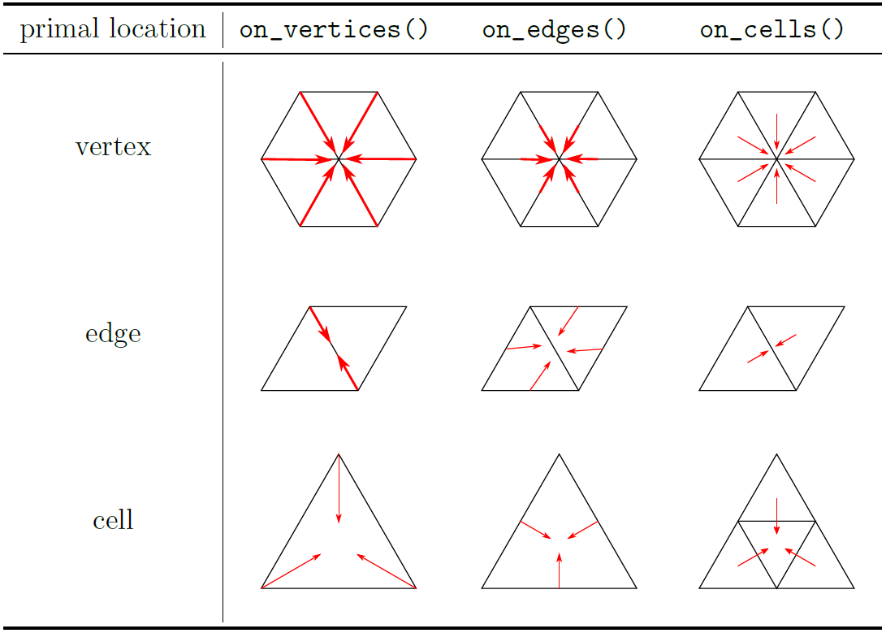

## Design of Grid Topology for Irregular Grids

The `GridTopology` concept provides: 

1. Connectivity information to neighbours in the same and different `LocationType`'s.
2. Storage maker functionality

The icosahedral `grid` class requires a class, as a template parameter, that implements a `GridTopology`
~~~~~~~~~~~~~~~~~~~ {.cpp .numberLines}
    template < typename Axis, typename GridTopology >
    struct grid
~~~~~~~~~~~~~~~~~~~

and can be constructed additionally with a runtime instance of the `GridTopology`, depending on whether 
the concrete implementation of that `GridTopology` requires runtime connectivity information.

Currently there are two concrete implementations of the `GridTopology`:

 1. The `icosahedral_topology` provides connectvity information at compile time, for icosahedral/octahedral grid layouts where all 
the connectivty information can be derived at compiled time from the parallelogram structures based on simple stride rules. 

An example of such structured index layout of the icosahedral grid parallelograms is shown in the figure below, 
where the parallelogram can be indexed with three coordinates `i` and `j` and a color that identifies downward/upward triangles. 
This particular data layout assumes an order in the dimensions like i-c-j (being `i` the stride-1 dimension). 
As an example, the cell with index 14, can be accessed with `{i,c,j}` coordinates `{2,0,1}`.
A similar scheme of indexing for `edges`, and `vertices` is developed. 
All neighbour indexes of any cell/edge/vertex as well as connectivity to different `LocationType` can be express with simple 
offset rules. 

For example, the neighbor indices of any cell can be computed with the following rules:

~~~~~~~~~~~~~~~~~~~ {.cpp .numberLines}
{{i-1,c-1,j},{i,c-1,j+1},{i,c-1,j}} for downward triangle (color==1)
{{i,c+1,j},{i+1,c+1,j},{i,c+1,j-1}} for upward triangle
~~~~~~~~~~~~~~~~~~~

Similar rules are derived for connectivities among different location types.


{width="0.6\columnwidth"}


Since all offset rules are based on the structured of the icosahedral parallelograms, and do not depend
on a particular runtime instance of the grid topology, they are derived at compile time. 
These offsets rules can be extracted using the connectivity class API

~~~~~~~~~~~~~~~~~~~ {.cpp .numberLines}
template < typename SrcLocation, typename DestLocation, uint_t Color >
struct connectivity
~~~~~~~~~~~~~~~~~~~

For the icosahedral grid, the connectivity tables give access to the following 9 type of queries, depending on the `from` and `to` location types

{width="0.6\columnwidth"}


```note
Depending on the location type, there are different number of neighbour indices. For example `from<cell>::to<edge>` will return a tuple of three
edge indices. The order of those neighbours, is part of the API and is defined based on physical meaning of PDE operators.
```

 2. The `unstructured_mesh` implements a `GridTopology` for grid layouts without a clear structure, and therefore runtime lookup tables 
need to be used in order to define connectivities between the different `LocationTypes`.

Since the connectivity information is stored as lookup tables, the `unstructured_mesh` needs to accept in the ctr an Atlas mesh object, 
that contains all the neccesary lookup tables. 
All 9 lookup tables are then stored in two type of (atlas data structure) tables: MultiBlockConnectivity and IrregularConnectivity.
The main difference is that the connectivity described with a MultiBlockConnectivity shows a uniform number of neighbours for each entry in the table, 
while in the IrregularConnectivity, each entry can have a different number of neighbours.

### Unstructured Mesh

The `grid` concept has a `GridTopology` type, that can be of two classes (as described above). 
Additionally for the types of `GridTopology` that require a runtime information with the connectivity tables, 
the `grid` also has an `unstructured mesh` instance of type

~~~~~~~~~~~~~~~~~~~ {.cpp .numberLines}
using unstructured_mesh_t =
   typename boost::mpl::if_c< is_unstructured_mesh< GridTopology >::value, GridTopology, empty >::type;
~~~~~~~~~~~~~~~~~~~

In case of having a `GridTopology` of `icosahedral_topology` the instance that gets instantiated is an empty class. 

Later this `unstructured_mesh` will be passed to the `iterate_domain` that requires the connectivity information. 


