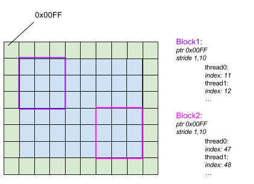
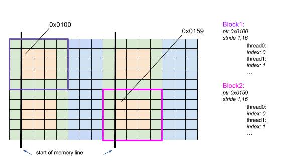

## New indexing algorithm

On the $\GT$ frontend side we are using `storage_info`, `data_store` and `data_view` objects when we deal with data.
Once this information is passed to the `aggregator_type` and the `intermediate` the information how to access the different
fields is extracted. This means we extract the raw pointers to the data from the `data_store` objects and the stride 
information is from the `storage_info` objects. The pointers and the strides informations are stored in the `iterate_domain`.
In order to save registers and not wasting resources different `storage_info` instances with a matching ID parameter are 
treated as a single instance. This can be done because the contained stride information has to be the same if the ID is equal.
Figure [Fig. \[fig:new\_indexing:flow\]]{} shows the storage flow from the frontend to the backend. In this example three data 
stores are created by the user, and two temporaries are created in the `intermediate`. The `intermediate` is extracting the needed
information from the `data_store` and `storage_info` objects and is feeding the backend with raw data pointers and stride information. 

{width="0.6\columnwidth"}

###Current indexing

As seen before the backend contains stride information and raw data pointers. Unfortunately this is not enough.
The backend additionally has to store an offset (called index). The reason for this is that the compute domain is
split up into several blocks. Each block is passed to a GPU streaming multiprocessor that contains several cores. 
Each core has to know its position within the block in order to compute at the right point. So additionally to the
stride and pointer information that is shared per block an index is stored per core. Figure [Fig. \[fig:new\_indexing:block\_contents\]]{}   
shows the contents of two independent blocks. As visible the stride and pointer information is the same but the index is different for each
thread.

{width="1.0\columnwidth"}

The index is computed as follows. If there is no halo the index will be 

$$ i = (block\_id\_x * block\_size\_x + thread\_id\_x) * stride\_i + (block\_id\_y * block\_size\_y + thread\_id\_y) * stride\_j $$

In case of a halo the index is shifted into the right direction (like visible in Figure [Fig. \[fig:new\_indexing:block\_contents\]]{}). 

###Issues regarding temporaries

Temporary storages share the same `storage_info` because they all have the same size. The problem with temporaries is that
computations in the halo region have to be redundant because we don't know when the data will be available. To solve the 
problem with redundant computations the temporary storages, that are allocated in the `intermediate`, are extended by a certain 
number of elements. The size of the cuda block is known beforehand and also the size of the halo and the number of blocks/threads 
is known. With this information an extended temporary storage can be instantiated. For performance reasons we want the first 
non-halo data point of each block to be in an aligned memory position. Therefore we add a certain number of padding elements between 
the blocks. Figure [Fig. \[fig:new\_indexing:temporary\]]{} compares the non-aligned versus the aligned storages. The green dots 
are marking the halo points. It can be seen that each block has its own halo region. The blue squares are padding elements and the yellow
squares are data points. As visible on the right part of the drawing the first data point should be in an aligned memory position.
In order to achieve this padding elements are added between the blocks.

{width="1.0\columnwidth"}

__Base pointer change__

When the aligned temporary improvement was introduced the logic in the backend was slightly changed. As shown before the backend contains
a pointer to each of the `storage`. In combination with an index the cuda thread can identify its compute position. When temporaries are used
one cannot just simply use a base pointer for all the cuda blocks and just multiply the current block index with the block size like shown
in the formula above. The base pointer has to be computed per block. So each block contains a pointer to its own temporary storage. 

{width="1.0\columnwidth"}

There is no difference in resource consumption when using the changed base pointer approach. It was mainly introduced for
convenience and in order to smoothly integrate the aligned temporary block improvement.

__Multiple temporaries with different halo__

Formerly $\GT$ used one `storage_info` per temporary storage. This is convenient but consumes more resources than needed.
Therefore it was replaced by the more resource efficient \"one `storage_info` for all temporaries\" solution.
The temporaries are all having the same size. So the stride information can be shared in the backend. The only problem occurs
when different temporaries (with the same size, as mentioned before) are accessing different halos. The base pointer is set 
correctly only for the temporary that is using the maximum halo. All the other temporaries are unaligned by $max\_halo - used\_halo$
points. This happens for instance when computing the horizontal diffusion. The flx and fly temporaries use different halos. In this case
the temporary written in the flx stage will be properly aligned because it is accessing the maximum halo in the aligned direction (x direction). The second temporary written in the fly stage will be unaligned because it does not use the halo points in x-direction. In order to fix this alignment mistake 
the missing offset is added when setting the base pointer. The information that is passed to the algorithm that extracts the base pointer knows about
the used halo of each `storage` and also the maximum halo in the alinged direction. A value of $max\_halo - used\_halo$ is added to each base pointer.

__Passing huge types down to the offset computation__

In order to fix the alignment when using different halos we have to pass a lot of type information from the `intermediate` down to the backend. This is exhaustive for the compiler and the performance suffers. This could lead to problems, especially when trying to compile computations with many stages and
a high number of fields.

###New indexing proposal

The new indexing approach tries to avoid the strategy of setting the base pointer to the first point of the block. The new approach is to set the
pointer to the first non-halo point of the block. The method that is setting the index of each cuda thread has to be modified. Figure [Fig. \[fig:new\_indexing:new_temporary_block_contents\]]{} shows the new indexing. As shown, the first non halo point is used as base pointer. The index
is also modified in order to point to the correct data location.

{width="1.0\columnwidth"}
