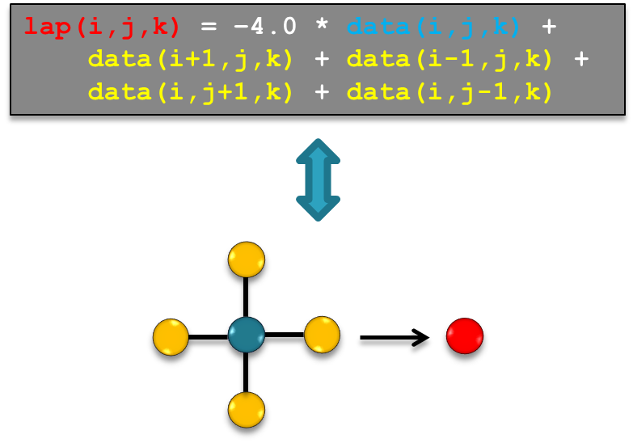

Quick Start Guide {#sec:getting_started}
=================

This chapter describes how to use $\GT$ to solve a (simple) PDE.
We will use the fourth-order horizontal smoothing filter example from
with small modifications to explain the necessary steps to assemble a
stencil from scratch. We will not go into details in this chapter but
refer to latter chapters for more details.

Our example PDE is given by $$\label{eq:getting_started:examplepde}
\frac{\partial \phi}{\partial t} =\begin{cases}
- \alpha \nabla^4 \phi & z \leq z_\text{max}\\
0 & z > z_0
\end{cases}$$ where $\nabla^4$ is the squared two dimensional horizontal
Laplacian and we apply the filter only up to some maximal $z_0$ (to make
the example more interesting). The filter is calculated in two steps:
first we calculate the Laplacian of $\phi$

$$L = \Delta \phi = \left( \frac{\partial^2}{\partial x^2} + \frac{\partial^2}{\partial y^2}\right) \phi$$

then we calculate the Laplacian of $L$

$$-\alpha \nabla^4 \phi = -\alpha  \Delta L$$

In the following we will walk through the following steps:

-   The $\GT$ coordinate system and its notation.

-   Storages: how does $\GT$ manage the input and output fields.

-   The first stencil: calculating $L$, the second order Laplacian of
$\phi$.

-   The final stencil: function calls, Do-method overloads and
temporaries

-   MISSING: How to pass the $\alpha$: Global accessors

-   MISSING: Distributing the work over multiple nodes: GCL

-   MISSING: Boundaries

Coordinate System
------------------

For a finite difference discretization we restrict the field
$\phi \in \mathbb{R}^3$ to a discrete grid. We use the notation
$i = x_i$ and $j = y_j$ for the horizontal dimension and $k = z_k$ for
the vertical dimension, where $x_i, y_j, z_k$ are the $x,y,z$
coordinates restricted on the grid. The *computation domain* is defined
by all grid points in our domain of interest
$$\Lambda = (i,j,k) \quad \text{with}\quad i \in \{ 0\dots N_i-1\}, j \in \{0\dots N_j-1\}, k\in\{0 \dots N_k-1\}$$

$\GT$ supports any number of dimension, however it will treat
one dimension, here the $k$, dimension differently: the $ij$-plane is
executed in parallel while the computation in $k$ can be sequential. The
consequence is that there must not be a dependency in $ij$ within a
stencil while there can be a dependency in $k$. For now (this chapter)
it is sufficient to just remember that the $ij$-plane and the $k$
dimension are treated differently by $\GT$.

The calculation domain is surrounded by a *boundary region* as depicted
in [Fig. \[fig:getting\_started:coordinates\]]{}. Computation happens
only within the calculation domain but values might be read from grid
points in the boundary region.

{width="0.6\columnwidth"}

Storages
------------------

In this section we will setup the fields for our example: we need a
storage for the $\phi$-field (`phi_in`) and a storage for the output
(`phi_out`).

Storages in $\GT$ are n-dimensional array-like objects with the
following capabilities:

-   access an element with $(i,j,k)$ syntax

-   copying between CPU memory and a device (e.g. a CUDA capable GPU)

Backend
-------

Since the storages (and other things later) depend on the architecture
(CPU or GPU) our first step is to define a *backend* type which
typically looks like 

~~~~~~~~~~~~~~~~~~~ {.cpp}
using backend_t = backend< Cuda, structured, Block >;
~~~~~~~~~~~~~~~~~~~ 

for the CUDA backed or for the CPU backend. The
second argument defines the type of the grid, where ``phi_in`` refers to a
Cartesian grid, see [Chapter [sec:grids]] for details. The last
argument defines that blocking should be used in CPU mode (instead of
``phi_out`` without blocking). For the CUDA mode [``]{} is the only option.

Memory layout
-------------

For efficient memory access the index ordering has to be different for
CPUs ($k$ first) and GPUs ($i$ first). This is defined with the [``]{}.
For CUDA we use while we use on the host. We don’t go into more detail
here, since this should probably be constructed by the backend (at least
for standard use-cases). For now it is enough to know that the first
line should be used in GPU mode and the second in CPU mode.

The storage type
----------------

For each storage type we need to define the type of the data we want to
store in the field, e.g. `double`, and a `storage_info` type which will hold
information about size, alignment, strides etc. The `storage_info` needs a
unique index and a `layout_map` as defined before. These information are all
C++ types, i.e. known at compile-time. 

~~~~~~~~~~~~~~~~~~~ {.cpp}
using storage_info_t = backend_t::storage_info< 0, layout_t >;
using storage_t = backend_t::storage_type< double, storage_info_t >::type;
~~~~~~~~~~~~~~~~~~~ 

At run-time a `storage_info` is
initialized with the sizes of the field. Then a field can be
instantiated with the `info` object. 

~~~~~~~~~~~~~~~~~~~ {.cpp .numberLines}
uint_t Ni = 10;
uint_t Nj = 12;
uint_t Nk = 20;

storage_info_t info(Ni, Nj, Nk);

storage_t phi(info, -1., "phi");
storage_t lap(info, -1., "lap");
~~~~~~~~~~~~~~~~~~~

The first argument, the `meta`
object, is mandatory, while the other arguments are optional: a name for
the field and an initial value.

---------------

---------------------------------------------------   --------------------------------------------------------
{ width=20px height=20px }                                                        
                                                      For each `meta_storage` type you should use only one  
                                                      instantiation. The mapping between a storage and the  
                                                      run-time information in the `meta_storage` has to be  
                                                      done at compile time via the index. Thus $\GT$ cannot 
                                                      distinguish the storages by the run-time sizes passed  
                                                      to the `meta_storage`.                                
---------------------------------------------------   --------------------------------------------------------

---------------

We can now

-   retrieve the name of the field,

-   read and write values in the field using the parenthesis syntax,

-   copy the data to device or back to host (in Cuda mode)[^1].

Storage with halo
------------------

It is usually beneficial to align the storage to the location of the
first element of the calculation domain. Therefore it is possible to
tell the storage about the halo region. Since this will probably change
in the new storage design we will leave the documentation of this
advanced feature for later.

Stencils
------------------

A *stencil* is a kernel that updates array elements according to a fixed
access pattern.

Example: Naive 2D Laplacian
---------------------------

The simplest discretization of the 2D Laplacian is the finite difference
five-point stencil as depicted in
[Fig. \[fig:getting\_started:laplacian2D\]]{}. For the calculation of
the Laplacian at a given grid point we need the value at the grid point
itself and its four direct neighbors along the Cartesian axis.

{width="0.49\columnwidth"}

A naive C++ implementation of the 2D Laplacian stencil is provided in
[Listing \[code:getting\_started:cxx\_laplacian\]]{}.

Apart from the initialization (orange) the stencil implementation
consists of 2 main components:

-   Loop-logic (green): defines the stencil application domain and loop
order

-   Update-logic (blue): defines the update formula (here: the 2D
Laplacian)

Special care has to be taken at the boundary of the domain. Since the
Laplacian needs the neighboring points we cannot calculate the Laplacian
on the boundary layer and have to exclude them from the loop.

First $\GT$ stencil
---------------------------

In $\GT$ the loop logic and the storage order is implemented
(and optimized) by the library while the update function is implemented
by the user. The loop logic (for a given architecture) is combined with
the user-defined update function at compile-time by template
meta-programming (see
[Sec. \[sec:introduction:template\_meta\_programming\]]{}).

### Update-logic: $\GT$ 2D Laplacian

The update-logic is implemented with state-less functors. A
$\GT$ functor is a [``]{} or [``]{} providing a *static* method
called [``]{}. The update-logic is implemented in these [``]{}-methods.
As the functors are state-less (no member variables, static methods
only) they can be passed by type, i.e. at compile-time, and therefore
allow for compile-time optimizations.

In addition to the [``]{}-method, the functor contains [``]{}s. These
two [``]{}s are parameters of the functor, i.e. they are mapped to
fields passed to the functor. They contain compile-time information if
they are only used as input parameters, like the [``]{} accessor in the
example, or if we want to write into the associated field. Additionally,
the [``]{} defines which grid-points are needed by the stencil relative
to the current point. The format for the extent is

extent<i_minus, i_plus, j_minus, j_plus, k_minus, k_plus>

where [``]{} and [``]{} define an interval on the $i$-axis relative to
the current position; [``]{} is the negative offset, i.e. zero or a
negative number, while [``]{} is the positive offset. Analogously for
$j$ and $k$. In the Laplacian example,
[Listing \[code:getting\_started\_gtlaplacian\]]{}, the first two number
in the extent of the [``]{} accessor define that we want to access the
field at $i-1,i,i+1$. The accessor type and the extent is needed for a
dependency analysis in the compile-time optimizations for more complex
stencils.

The first template argument is an index defining the order of the
parameters, i.e. the order in which the fields are passed to the
functor. The [``]{} has to defined and stores all accessors in an
[``]{}.

A [``]{} method needs to have two parameters. The first one is a context
object [``]{} that is created and passed to the method by the library on
invocation. This object contains, among other things, the index of the
active grid point and the mapping of data-pointers to the [``]{}s. The
second argument is an interval on the $k$-axis where this implementation
should be executed. This allows to apply a different update-logic on
intervals by overloading the [``]{}-method. We will define this interval
later.

The body of the [``]{}-method looks quite similar to the one in the
naive implementation
[Listing \[code:getting\_started:cxx\_laplacian\]]{}, except that each
field access has to be wrapped by a call to the context object [``]{}.
This is necessary to map the compile-time parameter, the accessor, to
the field, a run-time object.

### Calling the stencil

In the naive implementation,
[Listing \[code:getting\_started:cxx\_laplacian\]]{}, the call to the
[``]{} is as simple as

int boundary_size = 1;
laplacian( lap, phi, boundary_size );

since it contains already all the information: the update-logic *and*
the loop-logic.

The $\GT$ stencil,
[Listing \[code:getting\_started\_gtlaplacian\]]{}, does not contain the
information about the loop-logic. We have to specify it in an abstract
platform-independent syntax, a *domain specific embedded language*
(DSEL), such that the backend can decide on the specific implementation.

For our example it looks as in
[Listing \[code:getting\_started:gtlaplacian:make\_computation\]]{}.

In line \[gt\_laplacian\_setup:arg\_phi\] and
\[gt\_laplacian\_setup:arg\_lap\] we define placeholders for the fields.
In the lines
\[gt\_laplacian\_setup:domain:start\]-\[gt\_laplacian\_setup:domain:end\]
the fields, i.e. the storages, are attached to these placeholders in the
[``]{}.

In lines \[gt\_laplacian\_setup:grid:start\] to
\[gt\_laplacian\_setup:grid:end\] we setup the physical dimension of the
problem. First we define which points on the $i$ and the $j$-axis belong
to the computational domain and which points belong to the boundary (or
a padding region). For now it is enough to know that these lines define
an axis with a boundary of size 1 surrounding the $ij$-plane. In the
next lines the layers in $k$ are defined. In this case we have only one
interval. We will discuss the details later.

In lines \[gt\_laplacian\_setup:computation:start\] to
\[gt\_laplacian\_setup:computation:end\] we create the stencil object.
We pass the domain (the mapping between placeholders and storages), the
grid (the information about the loop bounds) and a [``]{}. The [``]{}
contains a [``]{}, our Laplacian functor.

In more complex codes we can combine multiple $k$-independent stages in
a [``]{}. If we have a $k$-dependency we have to split the computation
in multiple [``]{}s.

The statement [``]{} defines that we want to iterate over $k$ in a
forward manner, i.e. starting from the smallest $k$-value to the
largest. Other options are [``]{} and [``]{}[^2]. For performance reason
one should use [``]{} whenever possible.

The next lines \[gt\_laplacian\_setup:ready\] and
\[gt\_laplacian\_setup:steady\] are mandatory: we allocate temporary
storages (in our case we don’t use any) and copy the fields to the
device (if we use the CUDA backend).

Line \[gt\_laplacian\_setup:run\] is self-explanatory: the stencil is
executed.

In the last line we free temporary storages and copy modified fields
back to the host.

In a more realistic application the [``]{} will be called multiple
times. If one wants to inspect the fields between runs (and before the
[``]{}) one has to manually copy the data back from device.

### Full $\GT$ Laplacian

Assembling stencils: smoothing filter
------------------

In the preceding section we saw how a first simple $\GT$ stencil
is defined and executed. In this section we will use this stencil to
compute the example PDE . A naive implementation could look as in
[Listing \[code:getting\_started:naive\_smoothing\]]{}.

For the $\GT$ implementation we will learn three things in this
section: how to define special regions in the $k$-direction; how to use
$\GT$ temporaries and how to call functors from functors.

Do-method overload
------------------

Our first $\GT$ implementation will be very close to the naive
implementation: we will call two times the Laplacian functor from the
previous section and store the result in two extra fields. Then we will
call a third functor to compute the final result. This functor, see
[Listing \[code:getting\_started:gt\_smoothing\_version1\]]{} shows how
we can specialize the computation in the $k$-direction. We define two
intervals, the [``]{} and the [``]{}, and provide an overload of the
[``]{}-method for each interval.

The intervals are defined as

Since we are working currently on a nicer API to define the intervals we
don’t want to describe the (non-trivial) details now. In short: the
first entry in the level is a so-called [``]{}, an abstraction to tell
that we want to split the axis here. The second entry is an offset
relative to the splitter. At runtime we assign an index of the k-axis to
the splitters. Then the [``]{} corresponds to the index in the [``]{}
entry. Additionally we have to define an [``]{} such that all intervals
are a strict subset of the [``]{}.

Finally, the call to [``]{} looks as follows[^3]

In this version we needed to explicitly allocate the temporary fields
[``]{} and [``]{}. In the next section we will learn about
$\GT$ temporaries.

$\GT$ temporaries
-------------------------

*$\GT$ temporary storages* are storages with the lifetime of the
[``]{}, i.e. they can be used by different stages assembled in one
[``]{} call. This is exactly what we need for the [``]{} and [``]{}
fields.

Note that we did not allocate the temporaries explicitly and we cannot
access them from outside of the computation. Therefore it might be
necessary sometimes to replace a temporary with a normal storage for
debugging.

To use temporary storages we don’t need to change the functors or the
[``]{}. We just have to replace the type of the *arg* from a normal
storage type to a temporary storage type. We don’t need the explicit
instantiations any more and we can leave out pointers to storages when
we build the domain. The new code looks as follows The temporary
storages are allocated in the [``]{} call and freed in [``]{}. Besides
the simplifications in the code (no explicit storage needed), the
concept of temporaries allows $\GT$ to apply optimization. Since
the temporaries, by definition, are only visible inside a computation,
$\GT$ is free to remove them if it does not break the semantics
of the algorithm.

Functor calls
-------------

The next feature we want to use is the *function call*. This will allow
us to get rid of the temporaries. In a first step we remove only one of
the temporaries. Instead of calling the Laplacian twice from the [``]{}
we will move one of the calls into the smoothing functor. The new
smoothing functor looks as follows In [``]{} we specify the functor and
the [``]{}-method overload we want to apply. In [``]{} the [``]{} is
passed forward followed by all the input arguments for the functor. The
functor in the call is required to have exactly one [``]{} which will be
the return value of the call.

The new setup looks as follows

The attentive reader may have noticed that our first versions did more
work than needed: we calculated the Laplacian of the Laplacian of phi
($\Delta \Delta \phi$) for all $k$-levels, however we used it only for
$k<k_\text{max}$. In this version we do a bit better: we still calculate
the Laplacian ($L = \Delta \phi$) for all levels but we only calculate
$\Delta L$ for the levels where we need it.

#### Outlook

Eventually we would like to get rid of this problem (and the last
temporary) in an elegant way with nested function calls as follows
Unfortunately, this is currently not supported in $\GT$[^4].

Full code listing {#mm}
------------------

The full compilable version of the code is given in [Full code listing](#full_lap)

~~~~~~~~~~~~~~~~ {#full_lap .cpp .numberLines}
#include <common/defs.hpp>
#include <stencil-composition/stencil-composition.hpp>

using namespace gridtools;
using namespace gridtools::enumtype;
using namespace gridtools::expressions;

constexpr static gridtools::dimension< 1 > i;
constexpr static gridtools::dimension< 2 > j;
constexpr static gridtools::dimension< 3 > k;

#ifdef __CUDACC__
using backend_t = backend< Cuda, structured, Block >;
using layout_t = gridtools::layout_map< 2, 1, 0 >;
#else
using backend_t = backend< Host, structured, Block >;
using layout_t = gridtools::layout_map< 0, 1, 2 >;
#endif

using storage_info_t = backend_t::storage_info< 0, layout_t >;
using storage_t = backend_t::storage_type< double, storage_info_t >::type;
/***/
using lower_domain = interval< level< 0, -1 >, level< 1, -1 > >;
using upper_domain = interval< level< 1, 1 >, level< 2, -1 > >;
using full_domain = interval< level< 0, -1 >, level< 2, -1 > >;

using axis = interval< level< 0, -2 >, level< 2, 1 > >;
/***/
struct lap_function {
    using in = in_accessor< 0, extent< -1, 1, -1, 1 > >;
    using lap = inout_accessor< 1 >;

    using arg_list = boost::mpl::vector< in, lap >;

    template < typename Evaluation >
    GT_FUNCTION static void Do(Evaluation const &eval, full_domain) {
        eval(lap(i, j, k)) = -4. * eval(in(i, j, k)) /***/
                             + eval(in(i + 1, j, k)) /***/
                             + eval(in(i, j + 1, k)) /***/
                             + eval(in(i - 1, j, k)) /***/
                             + eval(in(i, j - 1, k));
    }
};
/***/
#include <stencil-composition/structured_grids/call_interfaces.hpp>
struct smoothing_function_3 {
    using phi = in_accessor< 0 >;
    using lap = in_accessor< 1, extent< -1, 1, -1, 1 > >;
    using out = inout_accessor< 2 >;

    using arg_list = boost::mpl::vector< phi, lap, out >;

    constexpr static double alpha = 0.5;

    template < typename Evaluation >
    GT_FUNCTION static void Do(Evaluation const &eval, lower_domain) {
        eval(out(i, j, k)) = eval(phi(i, j, k)) -
                             alpha *                               /***/
                                 call< lap_function, full_domain > /***/
                                 ::with(eval, lap());
    }

    template < typename Evaluation >
    GT_FUNCTION static void Do(Evaluation const &eval, upper_domain) {
        eval(out(i, j, k)) = eval(phi(i, j, k));
    }
};
/***/
int main() {

    uint_t Ni = 10;
    uint_t Nj = 12;
    uint_t Nk = 20;
    uint_t kmax = 10;

    storage_info_t info(Ni, Nj, Nk);

    int bs = 2; // boundary size
    halo_descriptor boundary_i(bs, bs, bs, Ni - bs - 1, Ni);
    halo_descriptor boundary_j(bs, bs, bs, Nj - bs - 1, Nj);
    /***/
    using temp_storage_t = /***/
        backend_t::temporary_storage_type< double, storage_info_t >::type;

    storage_t phi(info);
    storage_t phi_new(info);

    using arg_phi = arg< 0, storage_t >;
    using arg_phi_new = arg< 1, storage_t >;
    using arg_lap = arg< 2, temp_storage_t >;

    using arg_list = boost::mpl::vector< arg_phi, arg_phi_new, arg_lap >;
    aggregator_type< arg_list > /** */
        domain(boost::fusion::make_vector(&phi, &phi_new));

    grid< axis > my_grid(boundary_i, boundary_j);
    my_grid.value_list[0] = 0;
    my_grid.value_list[1] = kmax;
    my_grid.value_list[2] = Nk - 1;

    auto smoothing = make_computation< backend_t >(           /***/
        domain,                                               /***/
        my_grid,                                              /***/
        make_multistage(                                      /***/
            execute< forward >(),                             /***/
            make_stage< lap_function >(arg_phi(), arg_lap()), /***/
            make_stage< smoothing_function_3 >(               /***/
                arg_phi(),                                    /***/
                arg_lap(),                                    /***/
                arg_phi_new())                                /***/
            ));                                               /***/
    /***/
    smoothing->ready();
    smoothing->steady();

    smoothing->run();

    smoothing->finalize();
}
~~~~~~~~~~~~~~~~

How to pass the $\alpha$: Global accessors
------------------

Distributing the work: GCL
------------------

Boundary conditions
------------------
