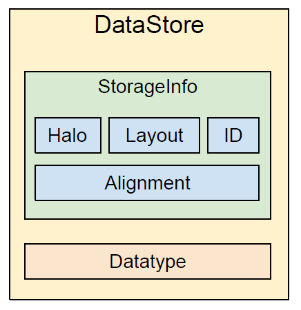
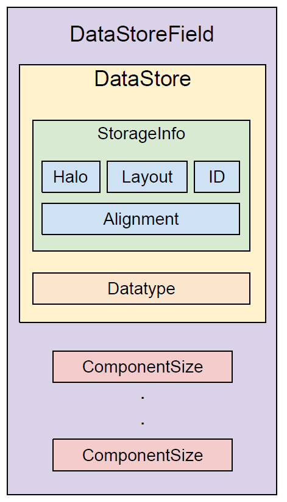
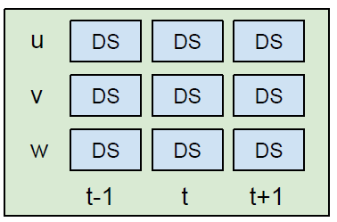

Storage module {#sec:storage}
=================

The storage module is one of the main modules in $\GT$. Main target of this module is to provide proper means to access, view, and modify data. The underlying hardware is abstracted as far as possible.
Different backends are available for different kinds of storages (e.g., Cuda or Host). Following subsections will explain the different basic elements that are used in the storage module. 

##Storage info

The storage info element can be seen as a meta data object that keep information about a storage. This information is alignment, data layout in memory, halo areas, dimensionality, size of the storage, etc.
The object must be created before storage can be allocated. The meta data or storage info object can be shared among different storages. The reason is that it is usual that multiple storages used in one computation are having the same meta data. The storage info object is created in the following way:

`host_storage_info< Id, Layout, Halo, Alignment >(Dims...)` for host storage infos.
`cuda_storage_info< Id, Layout, Halo, Alignment >(Dims...)` for cuda storage infos.

{width=300}

Passed type information:

* **Id**:
A unique identification for the storage info type

```note
For each `storage_info` type you should use only one  
instantiation. The mapping between a storage and the  
run-time information in the `storage_info` has to be  
done at compile time via the index. Thus $\GT$ cannot 
distinguish the storages by the run-time sizes passed  
to the `storage_info`. If you want to instantiate 
multiple `storage_info` with the same halo, alignment, layout
but with different dimensionality you must use a different ID.                                
```

* **Layout map:** Information about the memory layout. For instance a C array `X[i][j][k]` layout would be equivalent to `layout_map<0,1,2>`. The innermost dimension has the highest index. A Fortran style array `X[i][j][k]` layout would be equivalent to `layout_map<2,1,0>`.
There is also the possibility to mask dimensions. This means that the storage appears as n-dimensional but the masked dimensions are ignored.
For instance a `storage_info` with `layout_map<1,-1,0>` describes a 3-dimensional storage but the j dimension is masked. 

* **Alignment:** Information about the alignment. There is the possibility to provide information about how the data points should be aligned in memory. This provides a huge performance gain for some architectures (e.g., GPUs). The storage module combines the alignment, layout, and halo information in order to align the non-halo data points of the innermost dimension in memory. The Host backend uses no alignment (`alignment<1>`) by default. The Cuda backend uses a default alignment of 32 data elements (`alignment<32>`).  

* **Halo:**
The halo information has to be passed as type information to the storage info. Reason for this is that the proper alignment can only be computed with given halo information. The storage info object provides aligned data points (non-halo points) for the innermost dimensions. The halo information is given as follows: `halo< Sizes... >` where sizes is the halo size of the corresponding dimension. E.g.,
`halo<2,4,0>` is a halo of size 2 in direction I+ and I-, halo of size 4 in direction J+ and J-, and no halo in K.

**Example**:
In the following example a storage info object with 
Id 0, 
2 dimensions, 
I-first layout, 
halo I size of 1, 
halo J size of 0,
and alignment 8 is created. 
Please note that the size of the halo has to be added to the arguments that are passed to the constructor.
```c++
    typedef host_storage_info<0, layout_map<1,0>, halo<1,0>, alignment<8> > storage_info_t;
    storage_info_t si(6,3); // 4 data points + 2 halo points in I, 3 data points and 0 halo points in J
``` 
{width=500}

**Interface**: 
The `storage_info` object provides methods for querying following information:

* dim: get the aligned size of a dimension.
* stride: get aligned the stride of dimension.
* unaligned_dim: get the unaligned size of a dimension.
* unaligned_stride: get the unaligned stride of dimension.
* begin: retrieve the position of the first non halo point.
* end: retrieve the position of the last non halo point.
* total_begin: retrieve the position of the first point (can also be a halo point).
* total_end: retrieve the position of the last point (can also be a halo point).
* length: retrieve the total number of data points (excluding padding, halo, initial offset). 
* total_length: retrieve the total number of data points (excluding padding, initial offset).
* padded_total_length: retrieve the total number of data points.
* index: retrieve the array index of a given coordinate.
* get_initial_offset: initial offset that is used in order to provide proper alignment.

##Data store

Once the `storage_info` object is created a `data_store` can be created. A `data_store` is keeping together the `storage_info` object and the actual memory allocation. The main purpose of the `data_store` is to provide means for synchronizing, keeping consistency, cleaning up memory, etc. A `data_store` can be copied and moved. When copying a `data_store` both instances will point to the same data. Basically it has the same behaviour as a shared pointer.  

{width=300}

```note
The template parameters taken by the data store have to be compatible. 
E.g., `data_store< cuda_storage<double>, host_storage_info< 0, layout_map<1,0> > >` 
is invalid because a `cuda_storage` is not compatible with a `host_storage_info`.
```

**Example**:
Following codes snippets show how data stores can be created. At first the user has to identify if the memory management is
done externally or not. If it is done externally the data store won't deallocate the memory. The standard use-case is to
use managed data stores. The data store can be initialized with a value or lambda and can optionally be named. 
```c++
    typedef host_storage_info<0, layout_map<1,0>, halo<1,0>, alignment<8> > storage_info_t;
    typedef data_store< host_storage<double>, storage_info_t > data_store_t;
    storage_info_t si(6,3); // 4 data points + 2 halo points in I, 3 data points and 0 halo points in J

    // standard use cases
    data_store_t ds1(si); // create a data store without a name (will allocate memory internally)
    data_store_t ds2(si, "ds2"); // create a data store with a name (will allocate memory internally)
    data_store_t ds3(si, 1.0, "ds3"); // create a named and value initialized data store
    data_store_t ds4(si, [](int i, int j) { return i+j; }, "ds4"); // create a named and lambda initialized data store 

    // copying a data store
    ds2 = ds1; // ds2 will deallocate the previously allocated memory and will point to the same data as ds1.

    // external pointer use case
    double* external_ptr = new double[si.padded_total_length()];
    data_store_t ds_ext(si, external_ptr); // create a data store that is not managing the memory
    ...
    delete [] external_ptr;
``` 

**Interface**:
The `data_store` object provides methods for performing following things:

* allocate: allocate the needed memory. this will instantiate a storage instance.
* reset: reset the data_store. maybe deallocates memory.
* dim: function to retrieve the (aligned) size of a dimension.
* padded_total_length: retrieve the total number of data points.
* total_length: retrieve the total number of data points (excluding padding, initial offset).
* length: retrieve the total number of data points (excluding padding, halo, initial offset).
* get_storage_ptr: retrieve a pointer to the underlying storage instance.
* get_storage_info_ptr: retrieve a pointer to the underlying storage_info instance.
* valid: check if underlying storage info and storage is valid.
* clone_to_device: clone underlying storage to device.
* clone_from_device: clone underlying storage from device.
* sync: synchronize underlying storage.
* reactivate_device_write_views: reactivate all device read write views to storage.
* reactivate_host_write_views: reactivate all host read write views to storage.
* name: retrieve the name of the storage.

```note
The data store cannot be used to modify or access the data. 
In order to do so we use the view concept.
```

##Data store field

Sometimes we don't want to keep just an amount of distinct `data_store` elements but instead we 
wan't to couple `data_store` elements together in an element. This can be done with a `data_store_field`.
A real world example for a `data_store_field` is for example wind speed. The wind speed consists of
three `data_store` objects. For each direction u, v, and w there is a distinct `data_store`.

{width=300}

A `data_store_field` can be seen as a collection of data stores. The collection is grouped into 
components and snapshots. A component is for instance wind speed in direction u, v, or w. 
A snapshot is used to express for instance component u at time step t+1. The operations that 
can be performed on a `data_store_field` are mostly the same as the `data_store` operations.
The difference is that the operations are performed to all `data_store` objects contained in the
field. E.g., calling sync on a `data_store_field` will forward the sync call to all `data_store` 
elements.

**Example**:

Following example shows a `data_store_field` with 3 components and 3 snapshots per component.

{width=200}

Such a field can be instantiated and used in the following way:
```c++
    typedef host_storage_info<0, layout_map<1,0> > storage_info_t;
    typedef data_store< host_storage<double>, storage_info_t > data_store_t;
    // variadic list (e.g., 3,3,3) is defining the number and size of components
    typedef data_store_field< data_store_t, 3, 3, 3 > data_store_field_t; 
    storage_info_t si(6,3); 
    data_store_field_t dsf(si); // instantiate the data_store_field
    // get a specific data_store
    data_store_t ds02 = dsf.get<0,2>(); // retrieve the second snapshot of component 1
    // swap the component 0 snapshot 0 with component 0 snapshot 1
    swap<0,0>::with<0,1>(dsf);
``` 

**Interface**:
The `data_store_field` object provides methods for performing following things:

* get method that is used to extract a data_store out of a data_store_field.
* set: method that is used replace a data_store in a data_store_field.
* allocate: explicit allocation of the needed space.
* reset: reset the data_store_field. 
* valid: check if all elements of the data_store_field are valid.
* get_field: get the content of the data_store_field.
* get_dim_sizes: retrieve the sizes of the data_store_field components.
* clone_to_device: clone underlying storages to device.
* clone_from_device: clone underlying storages from device.
* sync: synchronize underlying storages.
* reactivate_device_write_views: reactivate all device read write views to storages.
* reactivate_host_write_views: reactivate all host read write views to storages.

The storage module provides special operations that can be applied to a `data_store_field`.

* `swap< I, J >::with< M, N >(data_store_field)`: operation to swap the data store located at component I snapshot J with the data store located at component M snapshot N.
* `cycle< I >::by< N >(data_store_field)`: operation to cycle all snapshots of component I by N positions.
* `cycle_all::by< N >(data_store_field)`: operation to cycle all snapshots of all components by N positions. 
 
##Data view

The view provides means to modify the data stored in a `data_store`. 
Views can be generated (at the moment) for both Host (cpu) and Device (gpu).
Internally the view is a very simple struct that contains a pointer to the 
data and provides an `operator()(...)` in order to access and modify the data 
at a given coordinate. The view can be created in a read only mode. This 
can be benefitial because read only views do not trigger synchronizations.

**Example**:

Following example shows the instantiation of a `data_store` and a corresponding host and device view.
The host view can be used when the data is modified on a host. Device views can be passed to device 
code only. For instance if the user creates a device view to a `cuda_storage` the device view can be passed
to a kernel and used inside the kernel to access the data in a convenient way.
In case of a `host_storage` there is no device view available.

```c++
    ...
    template < typename View >
    __global__ void kernel(View s) {
        s(0, 0) = s(0, 10); // set (0,0) to 3.1415
    }    
    ...
    // instantiate a data_store and a data_store_field
    typedef cuda_storage_info<0, layout_map<1,0> > storage_info_t;
    typedef data_store< cuda_storage<double>, storage_info_t > data_store_t;

    storage_info_t si(20, 20);
    data_store_t ds(si);

    // create a view to ds (data_store)
    auto host_view_ds = make_host_view(ds); // read write view
    // set (0,10) to 3.1415
    host_view_ds(0, 10) = 3.1415;
    // synchronize the data store
    ds.sync();
    // create a device view
    auto device_view_ds = make_device_view(ds); // read write view
    // call kernel
    kernel<<<1,1>>>(device_view_ds);
    // synchronize the data store
    ds.sync();
    // reactivate the host view
    ds.reactivate_host_write_views();
    // expect (0,0) == (0,10)
    EXPECT_EQ(host_view_ds(0, 10), host_view_ds(0, 0));
```

**View validity**:

Views can become invalid. For instance it can happen that the user is creating a read write host view as
a first step. If the user is creating a device view without synchronizing before the data would become inconsistent.
Reason for this is because the internal state machine assumes that there will be a modification whenever a read write 
view is created. The validity and consistency of a view can be checked easily. If views should be reused after a 
synchronization they have to be activated manually via a call to `reactivate_host_views()` or `reactivate_device_views()`.

```c++
    ...
    auto host_view_ds = make_host_view(ds);
    auto ro_host_view_ds = make_host_view< access_mode::ReadOnly >(ds);
    // some modification on host side
    ...
    ds.sync()
    ...
    auto device_view_ds = make_device_view(ds);
    // some modification on device side
    ...
    ds.sync()
    // both write views are in an inconsistent state and cannot be used
    // read only view can be used (ro_host_view_ds)
    ds.reactivate_device_views();
    // device_view_ds is in a consistent state, 
    // host_view_ds is in an inconsistent state
    // ro_host_view_ds is in an inconsistent state
    // some modification on device side
    ...
    ds.sync()
    // both write views are in an inconsistent state and cannot be used
    // read only view can be used (ro_host_view_ds)
    ds.reactivate_host_views();
    // device_view_ds is in an inconsistent state, 
    // host_view_ds is in a consistent state
    // ro_host_view_ds is in a consistent state
    // some modification on host side            
```
**Interface**:

The `data_view` object provides methods for performing following things:

* valid: Check if view contains valid pointers, and simple state machine checks. Be aware that this is not a full check. In order to check if a view is in a consistent state use check_consistency function.
* dim: function to retrieve the (aligned) size of a dimension.
* operator()(...): used to access elements. E.g., view(0,0,2) will return the third element.
* padded_total_length: retrieve the total number of data points.
* total_length: retrieve the total number of data points (excluding padding, initial offset).
* length: retrieve the total number of data points (excluding padding, halo, initial offset).

* make_host_view(DataStore): used to create host views to data stores (read-write/read-only).
* make_device_view(DataStore): used to create device views to data stores (read-write/read-only). 
* check_consistency(DataStore, DataView): perform a full check if the given view can be used to modify or access the data in a proper way.

##Data field view

Normal views cannot be used to access data fields. So one option would be to extract `data_store` elements from the field and create the views 
manually. The second option is to create a `data_field_view` and call the `get` method that returns a `data_view` to the requested field.
The consitency and validity checks can be performed also on `data_field_view` objects.

**Example**:

Following example is creating a field view in order to modify data. 
The second code block shows that the same thing can also be done with
manually extracting the `data_store` from the `data_store_field` and 
creating the views afterwards.

```c++
    ...
    // access the first storage of the first dimension and set the first value to 5
    auto hv = make_field_host_view(f);
    // use the get field view and provided get methods
    hv.get< 0, 0 >()(0, 0, 0) = 5;
    hv.get< 0, 1 >()(0, 0, 0) = -5;

    // second option: manually get the view of the first storage element in the data view (equivalent to get<0,0>...)
    data_store< host_storage< double >, storage_info_t > partial_1 = f.get<0,0>();
    data_store< host_storage< double >, storage_info_t > partial_2 = f.get<0,1>();
    auto hv1 = make_host_view< access_mode::ReadOnly >(partial_1);
    auto hv2 = make_host_view< access_mode::ReadOnly >(partial_2);
    EXPECT_EQ(hv1(0, 0, 0), 5);
    EXPECT_EQ(hv2(0, 0, 0), -5);
    ...
```

##Storage facility

Writing the types all the time is cumbersome and unneeded. To get rid of this effort the storage module provides 
a `storage-facility` that provides the correct types for a chosen backend. Currently there are storage traits available
for the CUDA and the Host backend. 

The only header that has to be included to use the storage infrastructure is `storage/storage-facility.hpp`. This provides
the `storage-facility` which returns the correct types for the chosen backend. 

**Example**:

```c++
    #define BACKEND enumtype::Cuda
    // get the correct 3D layouted and aligned storage info suitable for the CUDA backend
    typedef storage_traits< BACKEND >::storage_info_t< 0, 3 > storage_info_t;
    // get a data store suitable for CUDA
    typedef storage_traits< BACKEND >::data_store_t< double, storage_info_t > data_store_t;
    // get a data store field suitable for CUDA
    typedef storage_traits< BACKEND >::data_store_field_t< double, storage_info_t, 2, 2, 2 > data_store_field_t;

    storage_info_t si(128,128,80);
    data_store_t ds(si);
    ...
```

**Interface**:

Following type queries are available:

* `storage_info_t< Id, Dims, Halo >`: Retrieve an n-dimensional storage info with the correct layout and memory alignment.
* `custom_layout_storage_info_t< Id, LayoutMap, Halo >`: Retrieve an storage info with a specific memory layout.
* `special_storage_info_t< Id, Selector, Halo >`: Retrieve an storage info with a masked dimensions. The selector defines which dimensions are masked (e.g., `selector<1,0,1>` I and K is not masked, J dimension is masked).
* `data_store_t < ValueType, StorageInfo >`: Get a data store type that contains a suitable storage type. 
* `data_store_field_t < ValueType, StorageInfo, Dims... >`: Get a data store field type that contains a suitable storage type. 


