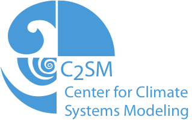
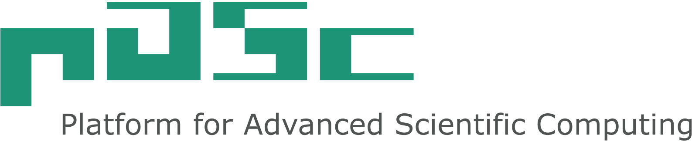

# Welcome to GridTools.
GridTools is a collection of C++ libraies for the development of grid applications, like PDE solvers. The main target applications for GridTools are complex real-world applications the need to be efficiently portable to different architectures, such as GPUs. The development is founded by the [PASC Initiative](http://www.pasc-ch.org/projects/projects/grid-tools/) of Switzerland.

<!-- .element width="50%" -->

